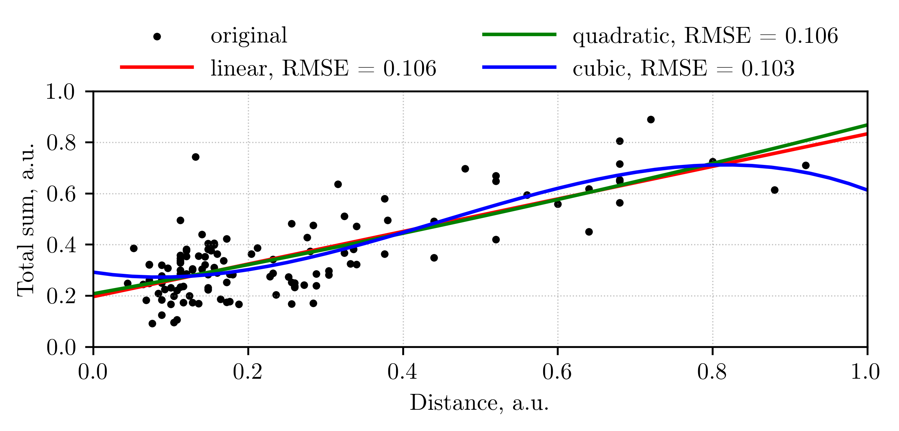
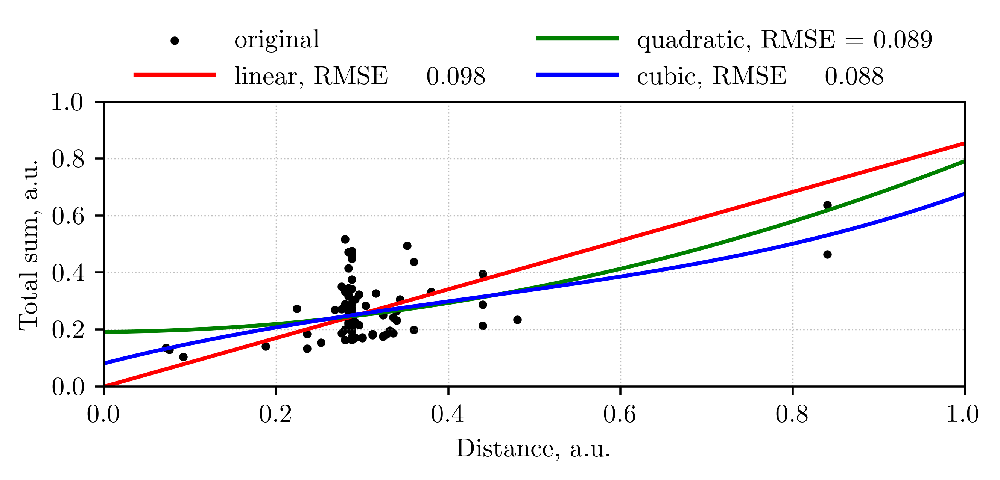
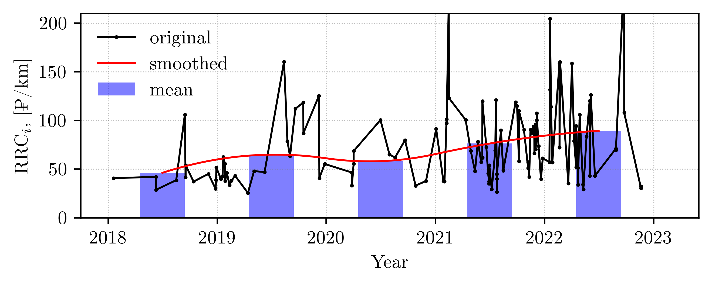
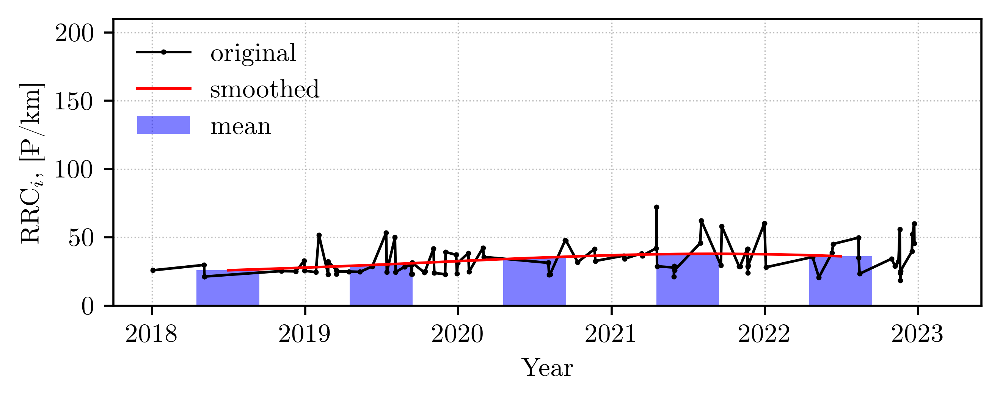
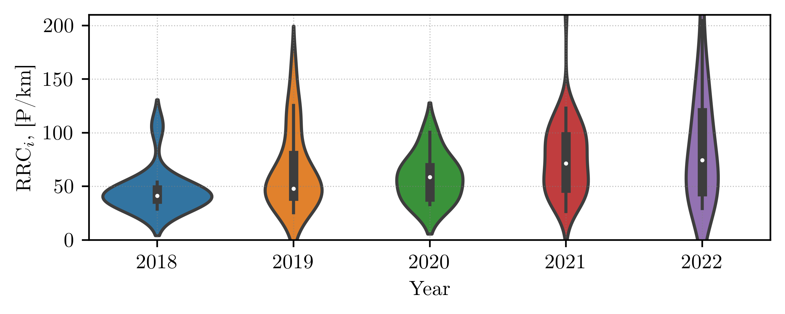
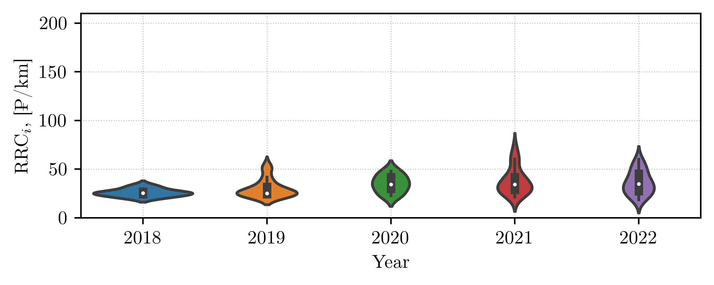

# What is it?

`TaxyAnalysis` - utility for quickly obtaining statistics of the average [Yandex taxi](https://taxi.yandex.ru/)
ride cost changes over time.

It is often interesting to understand how the price of taxi services has changed over the past few years. 
In the absence of open statistics, we can try to estimate this change based on our trips. 
This utility compares the average relative taxi ride cost using statistical criteria.

More details below.

# Requirements
- Python 3

# Usage

- Clone repository
```commandline
@: git clone https://github.com/VasilyevEvgeny/taxi_analysis.git
@: cd taxi_analysis
```
- Create virtual environment

*Windows:*
```commandline
@: python -m venv .venv
@: .\.venv\Scripts\activate
```

*Linux:*
```commandline
@: python -m venv .venv
@: source .venv/bin/activate
```
- Install essential packages
```
@: pip install -r requirements.txt
```

- Run `taxi_analysis.py`
```commandline
@: python taxi_analysis.py -h
TaxiAnalyzer - utility for quickly obtaining statistics of the average taxi ride cost changes over time
                                                                                                       
optional arguments:                                                                                    
  -h, --help            show this help message and exit                                                
  -p PATH, --path PATH  Path to data                                                                   
  -l LOCATION [LOCATION ...], --location LOCATION [LOCATION ...]                                       
                        Location(s) to analyze: Moscow, Vladimir or both                               
  -i AVERAGING_INTERVAL, --averaging_interval AVERAGING_INTERVAL                                       
                        Averaging time interval: year or quarter                                       
```
With default arguments (`-p data -l Moscow -i year`):
```commandline
python taxi_analysis.py
```
With all arguments:
```commandline
python taxi_analysis.py --path <path_to_data> --location <Moscow_or_Vladimir_or_both> --averaging_level <type_of_averaging>
```

# Preparing data
Script parses Yandex taxi ride reports in `.pdf`. To prepare data correctly you should:
- Attach email to personal account 
- For each ride in the ride history click "Send report to email"
- Save every email report as `.pdf` and move to specific folder (argument `-p (--path)` 
in script usage)

Example of ride report: [Moscow](resources/example_report_Moscow.pdf),
[Vladimir](resources/example_report_Vladimir.pdf)

# Description

It so happened that in my sample of trips, [Moscow](https://yandex.com/maps/geo/moskva/53000094/?ll=37.385534%2C55.584227&z=9.66) 
and [Vladimir](https://yandex.com/maps/geo/vladimir/53057138/?ll=40.422683%2C56.134849&z=12.04) are the most 
frequent cities, so the 
analysis was carried out for them. `TaxiAnalysis` has the ability to take them into account at the same time, 
but I think that this should not be done, since it will hardly be possible to come to constructive conclusions
based on such analysis.

For the selected cities, we will analyze the normalized dependence of the total ride cost on the route distance. 
Let's try to [approximate](https://scikit-learn.org/stable/modules/generated/sklearn.preprocessing.PolynomialFeatures.html) 
the specified dependence by polynomials of the 1-st, 2-nd and 3-rd degree.
  - *Moscow:*

  - *Vladimir:*


It can be seen that the [RMSE](https://en.wikipedia.org/wiki/Mean_squared_error) between the fitted curves 
and the original sample in the linear case approximately does not differ from the other two. So we can assume 
a linear relationship between the total ride cost and the route distance. The ratio of these quantities 
will be called *RRC (relative ride cost)* and actively used in further analysis.

Since in the history of trips *Economy* class is significantly more than the rest (*Comfort*, *Comfort+* and *Business*), 
only it was considered.

It is important to note that both relative and absolute cost of a trip change over time due to 
[inflation](https://en.wikipedia.org/wiki/Inflation). In `TaxiAnalysis`, inflation was taken into account 
as a piecewise linear function, constant within every year. For example, it was considered that in 2018 
inflation was equal to 5%, in 2019 - 6%, etc. The information about inflation changes was 
taken from [here](https://xn----ctbjnaatncev9av3a8f8b.xn--p1ai/%D1%82%D0%B0%D0%B1%D0%BB%D0%B8%D1%86%D1%8B-%D0%B8%D0%BD%D1%84%D0%BB%D1%8F%D1%86%D0%B8%D0%B8). 
*RRC* for the entire time was calculated in money at the time of April 2023 and was named *RRC_i* (*RRC inflated*). 
That is, if in April 2023 the cost of a trip was 100 rubles, then the cost of a trip in April 2018, initially also equal 
to 100 rubles, increased due to adjustments for inflation according to the specified piecewise linear function. 
As a result, the farther the cost of trips was from April 2023, the more it grew when inflation was taken into account. 
These adjustments make it possible to exclude the inflation factor when interpreting the results. 
Note that the approximation used is rough. In particular, inflation could be taken into account by months, not years, 
and not within the framework of the average for various industries, but specific to taxis. I think that 
the refinement of the inflation model will be appropriate with a further increase in the sample 
and the complexity of the analysis.

`TaxiAnalysis` generates 4 files:
- The results of the regression analysis described above
- Distribution of *RRC_i* from time in the original dataset, [mean](https://en.wikipedia.org/wiki/Expected_value) 
for each averaging 
period, as well as a [smoothed with a quadratic interpolation](https://docs.scipy.org/doc/scipy/reference/generated/scipy.interpolate.interp1d.html#scipy.interpolate.interp1d) 
curve based on these averaged values.
  - *Moscow:*

  - *Vladimir:*

- [Violin plot](https://seaborn.pydata.org/generated/seaborn.violinplot.html) (only for annual averaging interval), 
which shows the median, [interquartile range](https://en.wikipedia.org/wiki/Interquartile_range) and 
kernel-integrated distribution of trip density.
  - *Moscow:*

  - *Vladimir*

- Text file with calculation of statistical values (only for year averaging interval). It presents 
statistics for the entire sample and for each year separately. Using the [Shapiro-Wilk test](https://docs.scipy.org/doc/scipy/reference/generated/scipy.stats.shapiro.html), 
it is analyzed whether the distribution of each year is normal. If for each year the distribution 
of the target value turned out to be normal, then to compare the average values 
for each year we calculate mean within the framework of the [T-test](https://docs.scipy.org/doc/scipy/reference/generated/scipy.stats.ttest_ind.html). 
If there was at least one year when the distribution was not normal, then the [medians](https://en.wikipedia.org/wiki/Median) 
are compared and the [Mann-Whitney test](https://docs.scipy.org/doc/scipy/reference/generated/scipy.stats.mannwhitneyu.html) is used. 
Note that the [significance level](https://en.wikipedia.org/wiki/Statistical_significance) for all criteria is chosen 0.05.
    - [stats_Moscow.txt](resources/stats_Moscow.txt)
    - [stats_Vladimir.txt](resources/stats_Vladimir.txt)

As a result, none of *RRC_i* distributions was normal. Statistically significant differences in 
*RRC_i* values:
- Moscow:
  - *RRC_i(2018)* < *RRC_i(2021)*
  - *RRC_i(2018)* < *RRC_i(2022)*
- Vladimir:
  - *RRC_i(2018)* < *RRC_i(2020)*
  - *RRC_i(2018)* < *RRC_i(2021)*
  - *RRC_i(2018)* < *RRC_i(2022)*
  - *RRC_i(2019)* < *RRC_i(2021)*
